# OpenAct — Document Analysis Engine: Architecture

> A polyglot, three-tier, event-driven system for AI-powered legal document review.
> Stack: **Vue 3 (SPA)** → **Laravel 11 (API + Queue)** → **FastAPI (AI Kernel)** → **DeepSeek LLM**.

---

## 1. System Landscape (C4 — Context)

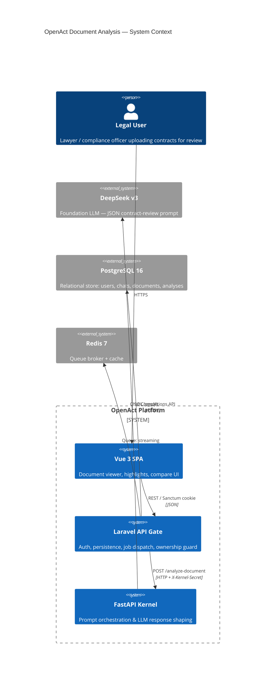

---

## 2. Container View (C4 — Containers)

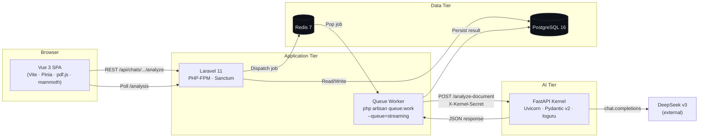

---

## 3. Component View — Inside Each Tier

### 3.1 Laravel API Gate

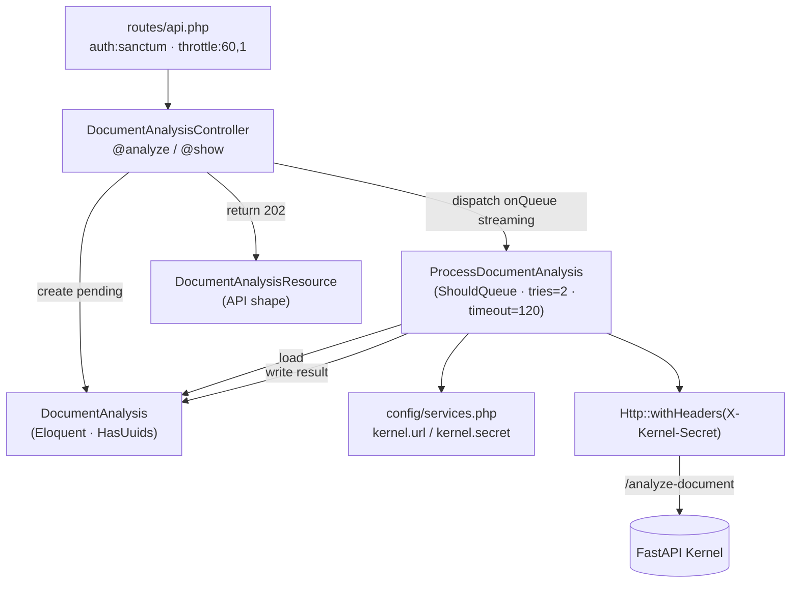

### 3.2 FastAPI Kernel

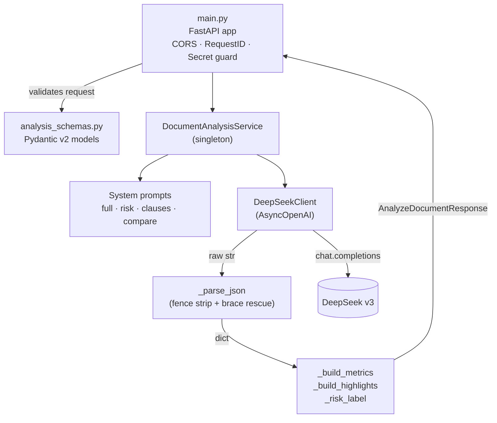

### 3.3 Vue 3 Frontend

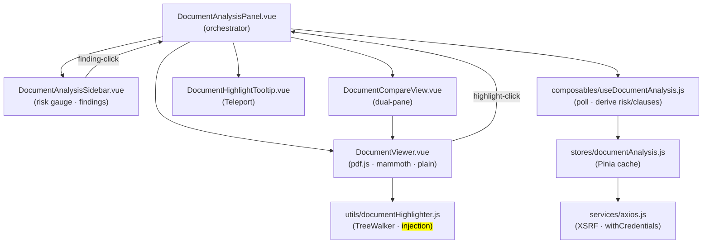

---

## 4. End-to-End Sequence — Triggering & Resolving an Analysis

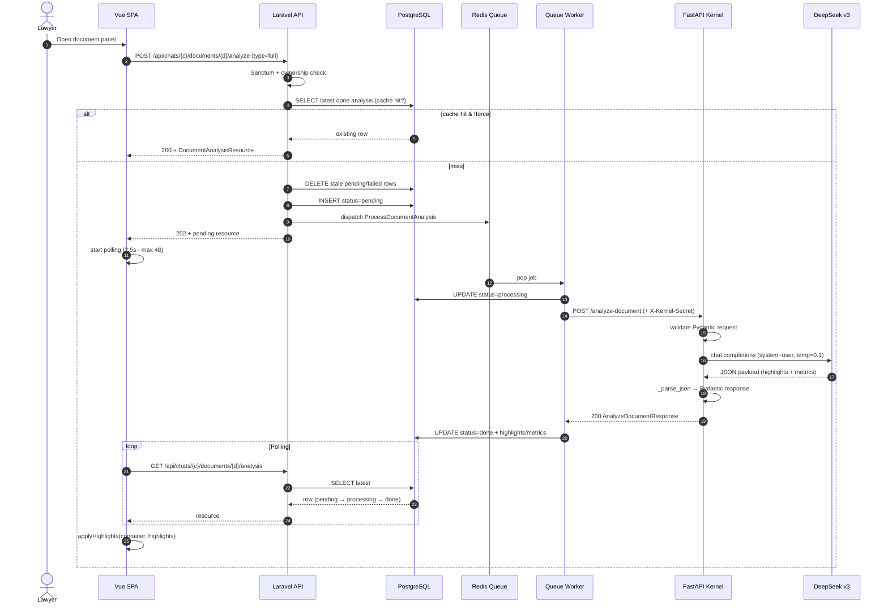

---

## 5. Data Model — Entity Relationship

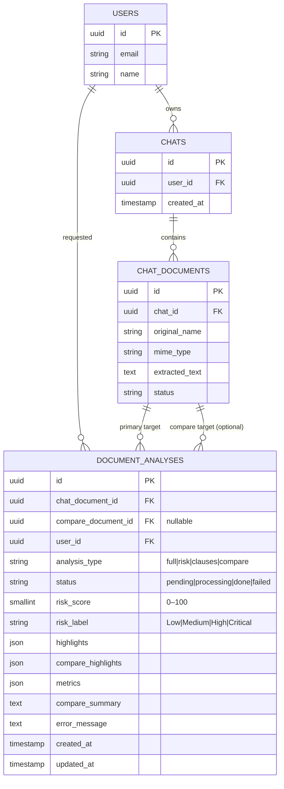

### Indexes on `document_analyses`

| Name                  | Columns                                                 | Purpose                                                    |
| --------------------- | ------------------------------------------------------- | ---------------------------------------------------------- |
| `da_doc_status`       | `(chat_document_id, status)`                            | Worker/controller filtering by state                       |
| `da_doc_type_compare` | `(chat_document_id, analysis_type, compare_document_id)` | Cache lookup for "already computed this exact view"       |
| `da_user_created`     | `(user_id, created_at)`                                 | User-centric history / audit                               |

---

## 6. JSON Contract (Kernel ↔ DeepSeek ↔ Worker)

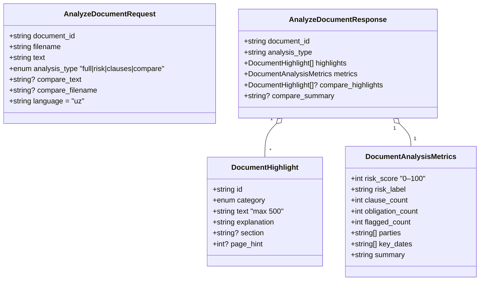

Highlight categories form a closed enum:

```
risk_high · risk_medium · risk_low · clause_key · obligation · party · date
```

---

## 7. Analysis State Machine

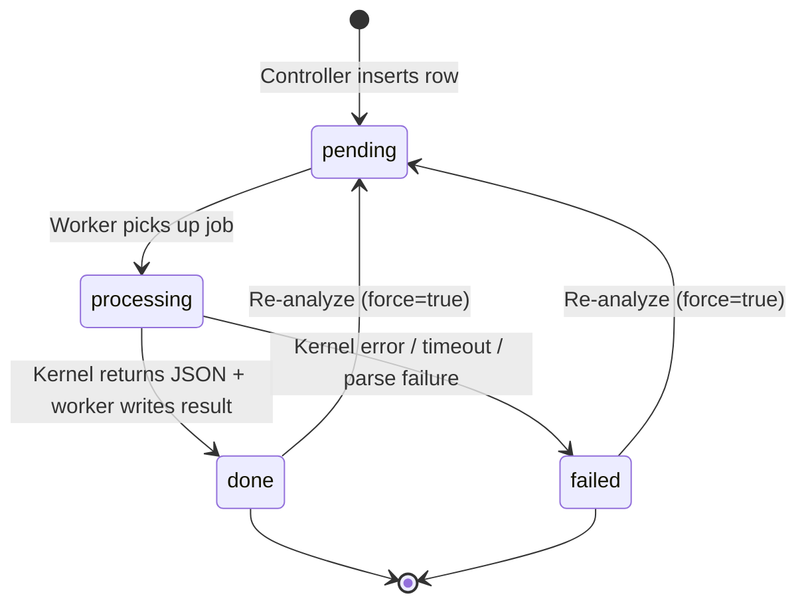

---

## 8. Deployment Topology (Docker Compose)

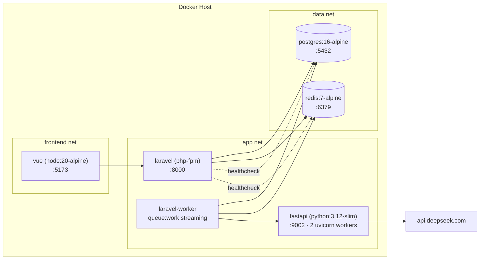

**Ports exposed to host:** `5173` (Vite), `8000` (Laravel), `9002` (FastAPI — local only), `5432`, `6379`.

---

## 9. Security & Trust Boundaries

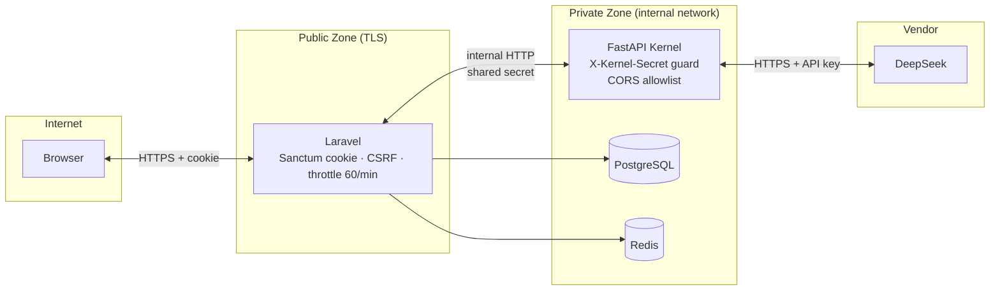

**Trust rules enforced in code:**

| Boundary              | Mechanism                                                                                    |
| --------------------- | -------------------------------------------------------------------------------------------- |
| Browser → Laravel     | `auth:sanctum` cookie, XSRF header (`axios.js`), `throttle:60,1`                             |
| Chat / Document ACL   | `authorizeAccess()` verifies `chat.user_id === request->user->id` and document∈chat          |
| Laravel → Kernel      | `X-Kernel-Secret` header (`config/services.php::kernel.secret`)                              |
| Kernel middleware     | `verify_secret` rejects any non-`/health` request without matching secret                    |
| Kernel CORS           | `KERNEL_ALLOWED_ORIGINS` env — defaults to Laravel + Vite origins only                       |
| Docs exposure         | `docs_url`/`redoc_url` disabled when `APP_ENV=production`                                    |
| Prompt length         | `_truncate` caps doc text at 60 000 chars (30 000 × 2 on compare) to bound token spend       |
| Output shape          | Pydantic `AnalyzeDocumentResponse` rejects malformed LLM output before persistence           |
| DOCX sanitization     | `DocumentViewer._sanitize` strips `<script>/<style>/on*=/javascript:` before `v-html`        |

---

## 10. Runtime Characteristics

| Concern             | Value / Policy                                                                        |
| ------------------- | ------------------------------------------------------------------------------------- |
| Queue               | Redis, dedicated queue `streaming`                                                    |
| Worker retry policy | `$tries = 2`, `$timeout = 120s` (Laravel Job)                                         |
| Kernel HTTP timeout | `Http::timeout(110)` (Laravel → FastAPI)                                              |
| Uvicorn workers     | 2 (Dockerfile `CMD`)                                                                  |
| LLM call            | `deepseek-v3`, `temperature=0.1`, `max_tokens=6000` (single) / `8000` (compare)       |
| Frontend polling    | 2 500 ms interval, max 48 attempts (~2 min ceiling)                                   |
| Idempotency         | Controller returns cached `done` row unless `force=true`                              |
| Observability       | loguru `X-Request-ID` propagation, Laravel `Log::info` on dispatch / success / fail   |

---

## 11. Analysis Type Matrix

| `analysis_type` | System Prompt      | Output Highlights                      | Notes                                  |
| --------------- | ------------------ | -------------------------------------- | -------------------------------------- |
| `full`          | `_SYSTEM_FULL`     | 8–40 across all 7 categories           | Default end-to-end review              |
| `risk`          | `_SYSTEM_RISK`     | Only `risk_high/medium/low`            | Frontend can also derive from cached `full` |
| `clauses`       | `_SYSTEM_CLAUSES`  | Only `clause_key`                      | Frontend can also derive from cached `full` |
| `compare`       | `_SYSTEM_COMPARE`  | `highlights_a` + `highlights_b` + `compare_summary` | Two-doc diff, splits token budget in half |

---

## 12. File Map

```
fgate_doc-analysis_engine_opt-v1/
├── docker-compose.yml          # 5 services: postgres · redis · laravel · laravel-worker · fastapi · vue
├── apigate/                    # Laravel 11 API Gate
│   ├── routes/api.php          # POST /analyze · GET /analysis
│   ├── app/Http/Controllers/Api/DocumentAnalysisController.php
│   ├── app/Http/Resources/DocumentAnalysisResource.php
│   ├── app/Jobs/ProcessDocumentAnalysis.php
│   ├── app/Models/DocumentAnalysis.php
│   ├── config/services.php     # kernel.url / kernel.secret
│   └── database/migrations/…_create_document_analyses_table.php
├── kernel/                     # FastAPI AI kernel
│   ├── main.py                 # App · middlewares · routes
│   ├── api/analysis_schemas.py # Pydantic request/response
│   ├── core/deepseek_client.py # AsyncOpenAI wrapper
│   ├── core/document_analysis_service.py # Prompts + JSON parsing + metrics
│   ├── requirements.txt
│   └── Dockerfile
└── frontend/                   # Vue 3 SPA
    ├── vite.config.js          # @ alias, /api proxy → :8000
    ├── package.json            # vue, pinia, vue-router, pdfjs-dist, mammoth, axios
    └── src/
        ├── services/axios.js
        ├── stores/documentAnalysis.js
        ├── composables/useDocumentAnalysis.js
        ├── utils/documentHighlighter.js
        └── components/DocumentAnalysis/
            ├── DocumentAnalysisPanel.vue
            ├── DocumentAnalysisSidebar.vue
            ├── DocumentViewer.vue
            ├── DocumentCompareView.vue
            ├── DocumentHighlightTooltip.vue
            └── DocumentPreviewModal.vue
```
